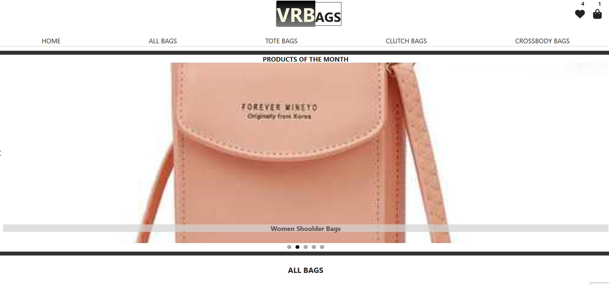
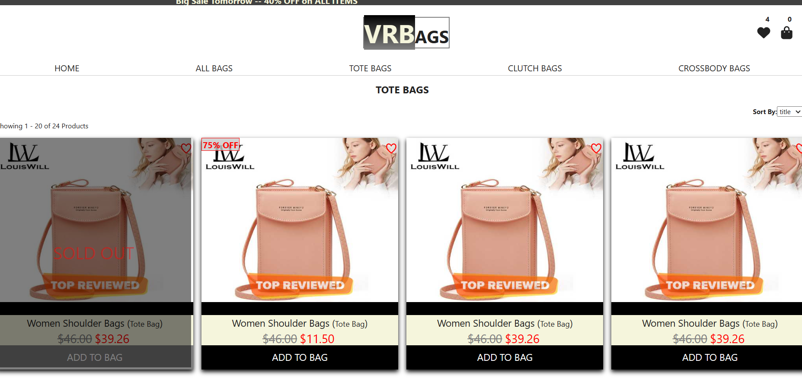
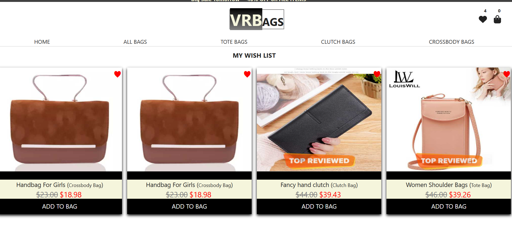
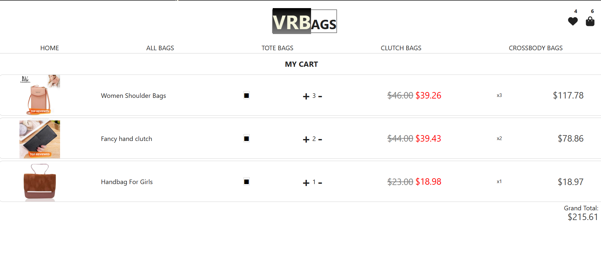
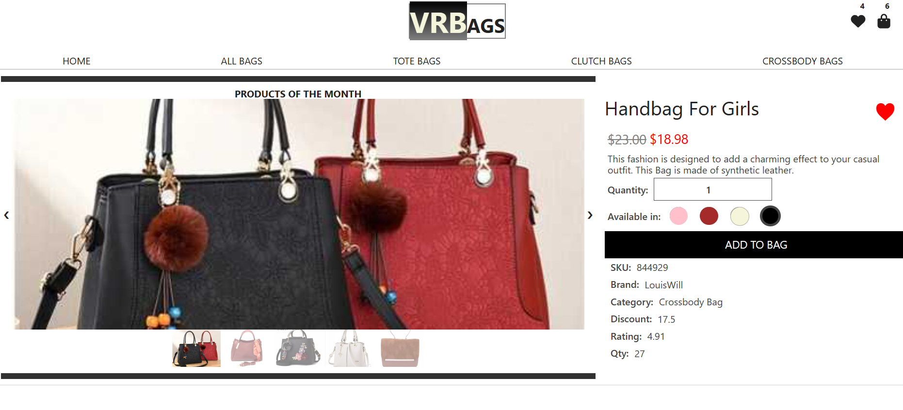
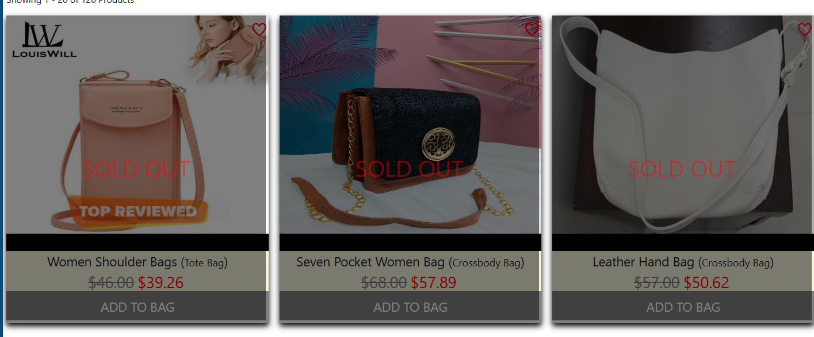
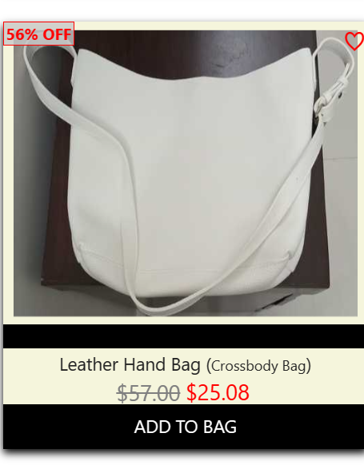
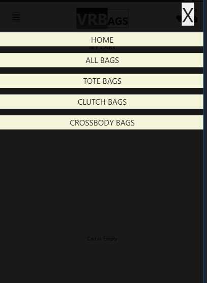

# E-Commerce Store in React JS
https://ammara-haroon.github.io/eshop/

## Snapshots
### Carousel

### Category Filtered Pages

### Wish List

### Cart

### Product Page

### Out of Stock Items

### Discount Badge

### Mobile Menu

## Project Description

The goal of the project is to build an e-commerce website in react with Firestore as backend.

## Project Requirements

- A home page containing a carousel for featured products
- A product grid
- A product page that allows buyers to add products to cart and select variants
- All products should be stored in Firestore with the following information:
  - quantity
  - variants
  - price per unit
  - name
  - image URL
  - favourited or not

## Tools Used:

React JS
Firestore

## Features and Design Approach

### Home Page

Home page contains carousel for featured products, animated ad banner and products grid.

##### Carousel

Carousel automatically displays the products like a slide show. The carousel component uses setTimeOut to achieve this effect. It selects all products from Firestore that have featured value equal to true.

#### Sale Banner

The sale banner is animated via CSS animation.

#### Product Grid

The products grid contains all products displayed as a grid of 4 elements per row. 20 products are displayed per page.

### Category Pages

Bags have different categories. All these categories are displayed on the same page that reads the search params from URL using searchParams hook and queries the database to get filtered results.

#### Page Selector

The page comes with an option to select next, previous or any page number.

#### Sorting

The page products can be sorted by selecting from drop down options. This is achieved by changing the navigation state in useNavigate hook. This keeps track of the selected option when the user moves away from the page.

### Wish List

Whenever the user clicks on the heart icon, the item's 'favourite' status is updated in the database and is added to the wish list page.

### Cart

Items can be added or removed from the cart. The grand total is displayed at the bottom. The cart is saved in session storage. Whenever an item is added to the cart a message is displayed that item has been added to the cart.

### Product Page

Product Page shows the details of the product and the user can use this page to add variants to the cart.

### Out of Stock

When an item is ordered beyond its stock limit, an 'out of stock' message is displayed to the user and is not allowed to add the product no matter which page is used. The product card in grid is also covered with an overlay and add to cart button is disabled.

### Discount Badge

Each product card displays a discount badge if the discount is more than 50%.

### Routing and Navigation

Routing is implemented via react router dom library. There is a mobile menu and a navbar depending on the screen size. There are two icons for wish list and cart in the top right corner. The icons also display number of items in the cart and wish list. The cart numbers are updated immediately as cart is in session storage, but the wish list count updates after a delay because the count is returned as a promise from API call to firestore.

### Toast Notifications
A toast notification appears each time an item is added to stock or when there is no more stock left to order.

### Error Page and Loading Spinner
- An user is directed to an error page if there is an issue in loading data.

## Known Issues 
- The number on favourites icon is not updated instantly. It might be because it's making an API call and waiting on a promise to be resolved. (Issue has been resolved)
- Prices are sorted on original values and not after applying discount

## Future Goals
- Add a stripe integration to cart
- Add a list of recommended projects to the product page.
- Add user authentication and account management system.

## Change logs
### 17/04/2024 - Added fake data to firestore
### 19/04/2024 - Built a Carousel  
### 20/04/2024 - Added a product grid
### 23/04/2024 
- Added Product Page 
- Added sales badge
- Added 'out of stock' overlay
- Added like button
### 24/04/2024 - Added Cart Services
### 25/04/2024 - Added Cart and product variants
### 26/04/2024 - Added logic to block user from adding to cart if stock limit has reached
### 29/04/2024 - Added Toast Notifications
### 29/04/2024 - Added Toast Notifications
### 30/05/2024 
- Moved favorite products to a context
- Changed product card design
- Changed buttons in carousel to allow infinite swiping 
### 31/05/2024 
- Fixed image overflowing carousel
- Fine-tuned toast notification animation
- Cleaned up console logs and code files

## Struggles
- Updating the count instantaneously for favourited products was an issue. It was resolved by moving the favourite products to a context.
- Keeping count of stocked item and blocking the user from adding items more than the stock limit required to put check on user interactions on different pages. 
